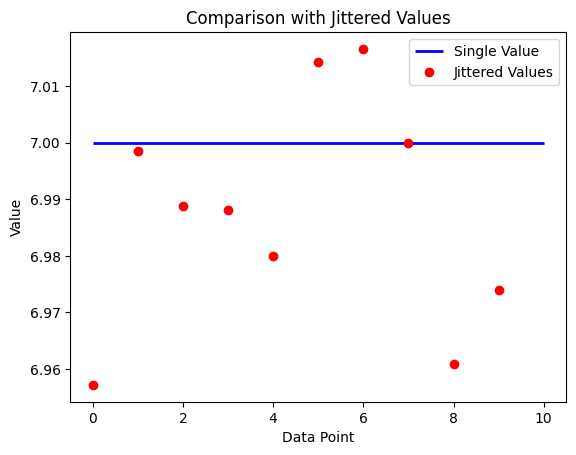

# jitterator
A Python decorator that jitters the parameters of a function to test its robustness.

## Installation

```sh
pip install git+https://github.com/yfiua/jitterator
```
## Usage

Add the decorator `@jitterate(jitter)` to the function. For example:

```python
from jitterator import jitterate

def test_fun(x, y, z):
    return x + y * z

@jitterate(.01)
def test_fun_jittered(x, y, z):
    return test_fun(x, y, z)

x, y, z = 1, 2, 3

val = test_fun(x, y, z)
res_jittered = [test_fun_jittered(1, 2, 3) for i in range(10)]
vals_jittered, args_jittered = zip(*res_jittered)
```

You can then plot the jittered results.



## TODOs

* Multiplicative jitters
* Separate jitters for different parameters
* Support more input parameter types (numpy etc.)
